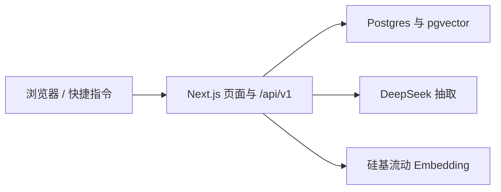

<p align="center">
  
</p>

# TokenConnection

只给自己用的人脉库。用一句话把人记进去，需要某类人的时候一句话找出来，按关系远近排好。

## 目录

- [现在做到哪一步](#现在做到哪一步)
- [架构](#架构)
- [快速开始](#快速开始)
- [仓库结构](#仓库结构)
- [公开命令](#公开命令)
- [文档](#文档)
- [安全](#安全)

## 现在做到哪一步

阶段 1 和阶段 2 已经能用：记人、找人、标签、时间线、同心圆地图、地理地图、该联系了。

还没做的是登录、把服务放到自己的服务器上，以及 iOS 客户端。手机上现在用浏览器「添加到主屏幕」，或按 [快捷指令说明](shortcuts/README.md) 把一句话丢进收件箱。

规格和取舍见 [设计文档](docs/design.md)。

## 架构



- `src/app/(app)/`：首页、人脉、地图、标签、收件箱。
- `src/app/api/v1/`：同一套接口，给页面和以后的客户端用。
- `src/lib/services/`：业务函数。页面和路由都走这里，不各自查库。
- `src/lib/llm/`：抽取和向量。`LLM_PROVIDER=mock` 时不访问网络。
- `docker-compose.yml`：本地 Postgres。数据库以后换机器，应用代码不用改。

## 快速开始

需要 Node 20 及以上、pnpm、Docker。

```bash
cp .env.example .env
docker compose up -d
pnpm install
pnpm db:migrate
pnpm db:seed
pnpm dev
```

打开 http://localhost:3000。`pnpm db:seed` 放入 14 个虚构的人；已有数据时会跳过，`pnpm db:seed --reset` 会重建。

首页输入框有三种模式：自动、记人、找人。记人模式有填空模板，Tab 跳到下一个【】，没填的空会去掉。`+` 开头强制记录，`?` 开头强制查询。

### 换上真实模型

1. 在 [DeepSeek](https://platform.deepseek.com/) 和 [硅基流动](https://cloud.siliconflow.cn/) 申请 key。
2. 写入 `.env` 的 `DEEPSEEK_API_KEY`、`EMBEDDING_API_KEY`，设 `LLM_PROVIDER=real`。
3. 重启 `pnpm dev`，再跑 `pnpm db:reembed`。

默认向量模型是硅基流动上的 `Qwen/Qwen3-Embedding-4B`，截到 1024 维。`Qwen3-VL-Embedding-8B` 在人物文本上区分度很差，不要用。查询侧会自动加一条任务说明，文档侧不加。

模型失败时仍然可以记人：收件箱标上错误，页面给出一张空表单，原文预填在摘要里。

## 仓库结构

```text
.
├── assets                  # 封面
├── docs                    # 设计文档、接口说明、文档入口
├── drizzle                 # 数据库迁移
├── public                  # 图标与 PWA
├── shortcuts               # iPhone 快捷指令说明
├── src
│   ├── app/(app)           # 页面
│   ├── app/api/v1          # REST
│   ├── components          # 界面
│   ├── db                  # schema、迁移入口、seed
│   ├── lib/services        # 业务函数，页面和 API 共用
│   ├── lib/llm             # 抽取、向量、mock
│   ├── lib/search          # 排序
│   ├── lib/geo             # 离线城市表
│   ├── lib/map             # 同心圆布局
│   └── lib/reminders       # 该联系了
└── docker-compose.yml      # Postgres 16 + pgvector
```

`.env`、依赖和构建产物在 `.gitignore` 里，不进入版本库。

## 公开命令

| 命令 | 用途 |
| --- | --- |
| `pnpm dev` / `pnpm build` / `pnpm start` | 开发、构建、生产启动 |
| `pnpm typecheck` / `pnpm lint` / `pnpm test` | 类型、ESLint、单元测试 |
| `pnpm db:generate` | 按 schema 生成迁移 |
| `pnpm db:migrate` | 执行迁移 |
| `pnpm db:seed` | 示例数据。`--reset` 先清空再写入 |
| `pnpm db:reembed` | 用当前模型重算全部向量 |
| `pnpm db:geocode` | 给还没坐标的人补经纬度。`--all` 重算所有非手动坐标 |
| `pnpm db:studio` | 打开 Drizzle Studio |

## 文档

入口是 [文档目录](docs/README.md)。

| 你要… | 打开 |
| --- | --- |
| 理解这个人脉库要做什么 | [设计文档](docs/design.md) |
| 调接口 | [HTTP API](docs/api.md) |
| 在手机上记一句 | [快捷指令](shortcuts/README.md) |

## 安全

真实的 key、数据库口令和 `API_TOKEN` 只放在被忽略的 `.env`。`.env.example` 里这些值是空的或占位符。文档不写密钥，也不写真实的联系人。

开发服务监听所有网卡，页面本身不登录：谁能打开这个地址，谁就能看到库里的人。只在自己的电脑上这样用。换一台机器或给手机长期用之前，先把 `API_TOKEN` 和 `POSTGRES_PASSWORD` 换成随机串。
