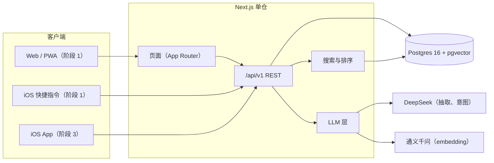
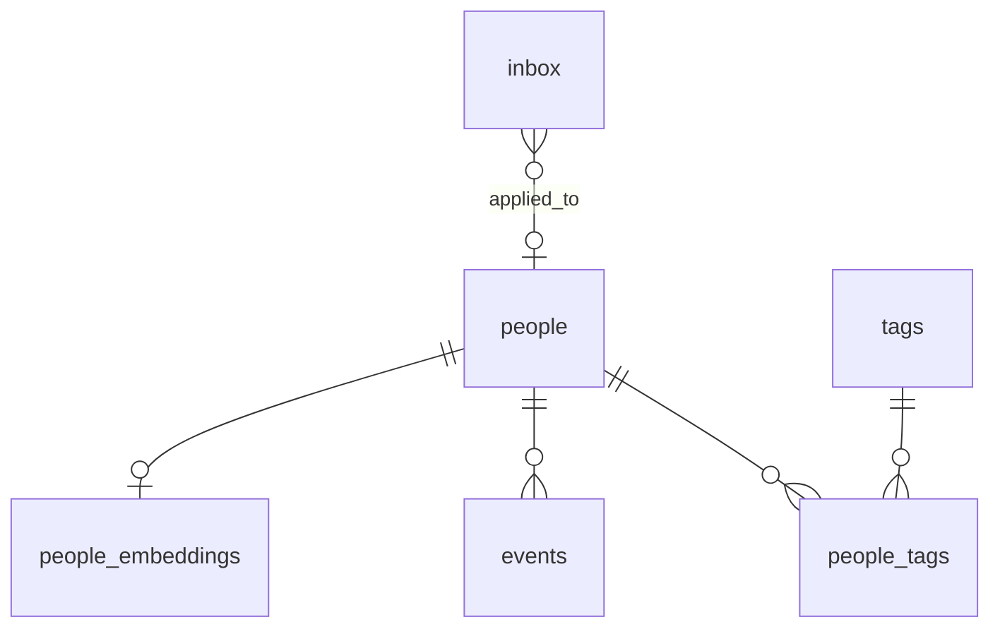
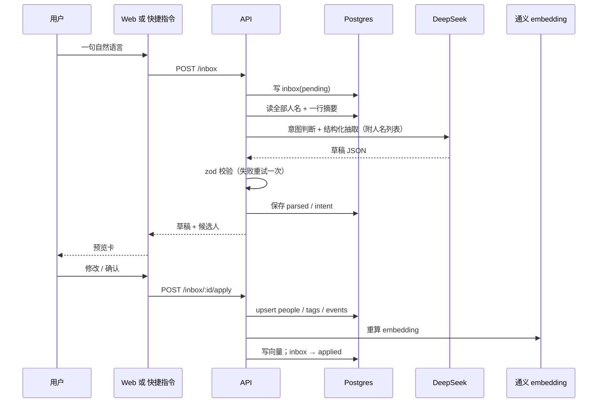

# TokenConnection 设计文档

> 个人人脉地图。状态：设计稿 v0.1，未开工。
> 本文是 2026-09-28 头脑风暴的沉淀，所有"决定"都可以在开工前推翻。

---

## 1. 一句话

一个只给我自己用的人脉库：用一句自然语言把人记进去，系统自动归档；需要某类人的时候一句话把人找出来，按关系远近排好；时间长了忘了某人是谁，打开卡片能立刻回忆起他做过什么、人怎么样。

## 2. 目标与非目标

### 目标

1. 快速添加、修改人脉：从"想记"到"记完"不超过 10 秒，手机上也能做到
2. 快速查找某件事相关的人脉："我想认识一个羽毛球教练"能直接推出人，且按关系远近排序
3. 至少二维的人脉地图
4. 按标签筛选人脉
5. 每个人至少有：联系方式、名字、性别、所在地、能力、摘要、关系远近
6. 关系远近五级：Best Bros、Close friends、Friends、Interacted contacts、People I know of
7. 时间线：记录他做过什么、我们之间发生过什么，解决"忘了这个人"的问题

### 非目标（至少 v1 不做）

- 多用户、团队协作
- 人与人之间的关系（谁认识谁、谁介绍了谁）。见决策记录 D-02
- 自动从微信、手机通讯录同步或抓取
- 社交网络式的动态、消息
- 批量导入通讯录（有意不做：会把库变成垃圾场，从有故事的人开始手动录）

## 3. 设计原则

1. 录入成本决定生死。所有功能设计先问一句：会不会让"记一个人"变慢。
2. 一个入口。页面顶部一个万能输入框，新增、更新、查询都从这里进。
3. API 优先。Web 只是第一个客户端，iOS 是第二个，后端从第一天就按被多个客户端消费来设计。
4. 原文永存。任何自然语言录入的原文都保留在 `inbox`，模型进步后可以重新解析。
5. 地图是"看"的，输入框是"用"的。每天用的是添加和查找，地图放第二阶段。
6. 数据在自己手里。数据库先在本地，将来在自己的服务器上；LLM 只是工具，不是存储。

## 4. 核心场景

场景 A，记人（手机上）
: 球馆认识了个人，加完微信，掏出手机对快捷指令说/打："今天球馆认识小王，羽毛球教练，深圳，微信 wx123，人很热情"。回家打开 web，inbox 里有一张预览卡，字段已经填好、标签已经打好、建议 tier 是 Interacted contacts，点确认。

场景 B，追加（电脑上）
: 输入框里打："小王上周帮我修了球拍"。系统识别出是已有的小王，生成一条 `helped_me` 事件，更新最近联系时间。

场景 C，找人
: 输入框里打："想找个人教我打羽毛球"。返回的第一个不是"羽毛球教练小王"，而是 Close friend 里那个大学校队的老李，因为他更近、我更能开口；小王排第二。老李的摘要里根本没出现"教练"两个字，这是语义检索做到的。

场景 D，回忆
: 半年后收到一个"老陈"的消息，完全想不起来是谁。搜"老陈"，卡片上写着：2025 年在某活动认识，做供应链，帮我看过一次合同，我的印象是"靠谱但话少"。

场景 E，看地图
: 打开地图，我在中心，五个环，按圈子分扇区。一眼看到"球友"这个扇区里 Close friends 环上有三个人，"前同事"扇区大部分人已经滑到了 People I know of。

## 5. 架构



要点：

- Next.js 一个仓库同时承载页面和 `/api/v1/*`。单人项目不值得拆前后端两个服务，但 API 层保持干净、无 web 专属逻辑，iOS 直接消费。
- 页面不直接访问数据库，一律走 API（或调用与 API 相同的 service 层函数），保证 web 和 iOS 走的是同一条路径。
- LLM 层封装成两个能力：`extract(rawText, context)` 和 `embed(text)`，provider 可换。

## 6. 技术栈

| 层 | 选择 | 理由 |
| --- | --- | --- |
| 框架 | Next.js（App Router，TypeScript） | 页面和 API 一个仓库；生态成熟 |
| ORM | Drizzle | 轻、贴近 SQL、pgvector 支持好、迁移工具 `drizzle-kit` |
| 数据库 | Postgres 16 + pgvector（Docker，`pgvector/pgvector:pg16` 镜像） | 本地和服务器完全一致；向量和业务数据同库 |
| 校验 | zod | 一份 schema 同时用于 API 输入校验和 LLM 输出约束 |
| UI | Tailwind + shadcn/ui | 快，移动端友好 |
| 地图 | D3（极坐标布局） | 同心圆地图几十行代码；无依赖大图库 |
| LLM SDK | Vercel AI SDK（`ai` + `@ai-sdk/openai-compatible`） | DeepSeek 和硅基流动都是 OpenAI 兼容接口，一个 provider 适配器搞定；`generateObject` 直接出 zod 校验过的对象 |
| 抽取模型 | DeepSeek `deepseek-chat` | 便宜、中文好、JSON 模式可用。实测 2026-09：一次抽取约 1 秒；`/models` 只列出 `deepseek-flash` 与 `deepseek-v4-pro`，`deepseek-chat` 仍可用，若下线改 `deepseek-flash` |
| Embedding | 硅基流动 `Qwen/Qwen3-Embedding-4B`，`dimensions=1024` 截断 | 原计划通义 `text-embedding-v3`，用户实际使用硅基流动（决策 D-05 更新）。先试 `Qwen3-VL-Embedding-8B`，在人的模板文本上 top-1 只有 2/6、相似度挤在 0.28–0.44；换文本模型 `Qwen3-Embedding-4B/8B/0.6B` 均 5/6 且区分度大，取 4B。查询侧加任务指令前缀（指令微调模型只在 query 侧加） |
| 包管理 | pnpm | 本机已有 |

注意：DeepSeek 不一定支持严格的 structured output，`generateObject` 用 `mode: 'json'`，服务端用 zod 二次校验，校验失败重试一次，再失败退化为手工表单。

> 阶段 1 实现说明：AI SDK ≥ 5 已移除 `generateObject` 的 `mode` 选项；等价做法是 openai-compatible provider 保持默认 `supportsStructuredOutputs: false`，SDK 会以 `response_format: { type: 'json_object' }` 调用并把 schema 注入 prompt。

## 7. 数据模型



### 7.1 枚举

```ts
// 关系远近，rank 越大越近。展示名沿用英文原名。
tier: 'best_bros'      // Best Bros            rank 5
    | 'close_friends'  // Close friends        rank 4
    | 'friends'        // Friends              rank 3
    | 'interacted'     // Interacted contacts  rank 2
    | 'known_of'       // People I know of     rank 1

gender:      'male' | 'female' | 'other' | 'unknown'
tag_kind:    'skill' | 'circle' | 'other'      // 能力 / 圈子 / 其他
event_kind:  'met' | 'helped_me' | 'i_helped' | 'hangout' | 'note'
inbox_status:'pending' | 'applied' | 'discarded'
inbox_intent:'add' | 'update' | 'query' | 'unknown'
```

### 7.2 表

```sql
create extension if not exists vector;

create table people (
  id               uuid primary key default gen_random_uuid(),
  name             text not null,
  gender           gender not null default 'unknown',
  location         text,                 -- 先存城市字符串，阶段 2 再加经纬度
  tier             tier not null default 'known_of',
  summary          text,                 -- 摘要：他是谁、做什么
  impression       text,                 -- 我的印象 / 品格，私密
  contacts         jsonb not null default '{}', -- {"wechat":"wx123","phone":"...","email":"..."}
  how_met          text,                 -- 怎么认识的
  met_at           date,
  last_contact_at  timestamptz,          -- 由 events 写入时维护
  created_at       timestamptz not null default now(),
  updated_at       timestamptz not null default now()
);

create table tags (
  id    uuid primary key default gen_random_uuid(),
  name  text not null,
  kind  tag_kind not null default 'other',
  unique (name, kind)
);

create table people_tags (
  person_id uuid references people(id) on delete cascade,
  tag_id    uuid references tags(id)   on delete cascade,
  primary key (person_id, tag_id)
);

create table events (
  id           uuid primary key default gen_random_uuid(),
  person_id    uuid not null references people(id) on delete cascade,
  kind         event_kind not null default 'note',
  content      text not null,
  happened_at  date not null default current_date,
  created_at   timestamptz not null default now()
);
-- 只追加，不修改历史。

create table people_embeddings (
  person_id   uuid primary key references people(id) on delete cascade,
  model       text not null,             -- 例如 'text-embedding-v3'
  embedding   vector(1024) not null,
  source_text text not null,             -- 当时被向量化的文本，便于排查
  updated_at  timestamptz not null default now()
);
create index on people_embeddings using hnsw (embedding vector_cosine_ops);

create table inbox (
  id          uuid primary key default gen_random_uuid(),
  raw_text    text not null,
  source      text not null,             -- 'web' | 'shortcut' | 'ios'
  status      inbox_status not null default 'pending',
  intent      inbox_intent,
  parsed      jsonb,                     -- LLM 输出的草稿
  applied_to  uuid references people(id) on delete set null,
  error       text,
  created_at  timestamptz not null default now(),
  applied_at  timestamptz
);
```

### 7.3 几个设计说明

- 能力和圈子都是标签，用 `kind` 区分。一张表同时服务筛选、地图扇区和 LLM 自动打标。
- `contacts` 用 jsonb 键值对，不写死字段，微信 / 电话 / 邮箱 / 小红书想加就加。UI 上提供几个常用 key 的快捷输入。
- `impression` 和 `summary` 分开：摘要是客观的"他做什么"，印象是主观的"我觉得他怎样"。
- `last_contact_at` 不让用户手填，由 `events` 写入时自动更新为 `max(happened_at)`。
- 没有人↔人的边。如果将来要加，加一张 `relations(from_id, to_id, kind)` 即可，现有表不用动。

### 7.4 被向量化的文本

`people_embeddings.source_text` 按下面模板拼接，人被修改或新增事件时重算：

```
姓名：{name}
所在地：{location}
能力：{skill tags, 逗号分隔}
圈子：{circle tags}
摘要：{summary}
印象：{impression}
最近：{最近 5 条 events，每条 "YYYY-MM 内容"}
```

联系方式不进向量文本，也不进查询请求。

## 8. API

前缀 `/api/v1`。全部 JSON。错误统一 `{ error: { code, message } }`。

### 人

- `GET    /people?tier=&tag=&location=&q=&cursor=` 列表（结构化筛选 + 关键词）
- `POST   /people` 新建
- `GET    /people/:id` 详情（含 tags、最近 events）
- `PATCH  /people/:id` 更新
- `DELETE /people/:id`
- `PUT    /people/:id/tags` 整体设置标签
- `GET    /people/:id/events`
- `POST   /people/:id/events` 追加事件（顺带更新 `last_contact_at`，触发重算 embedding）

### 标签

- `GET  /tags?kind=`
- `POST /tags`
- `PATCH /tags/:id`（改名、改 kind）
- `DELETE /tags/:id`

### 搜索

- `GET /search?q=&tier=&tag=&location=&limit=`
  返回 `[{ person, score, reasons: ['semantic', 'keyword:name', 'tag:羽毛球'] }]`，见第 10 节排序规则。

### Inbox（万能输入框背后）

- `POST /inbox { raw_text, source }` 落库并立即解析，返回 `{ inbox, draft, candidates }`
- `GET  /inbox?status=pending` 待处理列表（手机上记的回电脑处理）
- `POST /inbox/:id/reparse` 重新解析
- `POST /inbox/:id/apply { draft }` 用用户确认（可能修改过）的草稿落库
- `POST /inbox/:id/discard`

> 阶段 1 实现说明：`POST /inbox` 额外接受可选 `person_id`（详情页"追加一句"用来强制 update 到该人），返回值多两个字段——`error`（LLM 失败时的原因，此时 `draft` 为退化的空表单）和 `results`（意图为 query 时直接附带搜索结果，且该条 inbox 立即标为 `discarded`，不在待处理列表里出现）；另加 `GET /inbox/:id`（返回已存草稿与候选人，不调 LLM）和 `DELETE /people/:id/events/:eventId`（事件允许删除，见 §19 问题 1）。

### 认证

- 阶段 1：所有 `/api/v1/*` 要求 `Authorization: Bearer <API_TOKEN>`，token 放 `.env`。Web 页面通过同源 cookie 带上同一个 token。
- 阶段 3 上服务器时再加登录页；不提前上 Auth.js。

## 9. 核心流程

### 9.1 快速添加 / 更新



抽取输出的 schema（zod，示意）：

```ts
const Draft = z.object({
  intent: z.enum(['add', 'update', 'query', 'unknown']),
  // update 时指向已有的人；add 时为空
  target_person_id: z.string().uuid().nullable(),
  // 模型对"是否是已有的人"的把握，低于阈值时前端让用户点选
  target_confidence: z.number().min(0).max(1),
  person: z.object({
    name: z.string().nullable(),
    gender: Gender.nullable(),
    location: z.string().nullable(),
    tier: Tier.nullable(),
    summary: z.string().nullable(),
    impression: z.string().nullable(),
    contacts: z.record(z.string()).default({}),
    how_met: z.string().nullable(),
    met_at: z.string().date().nullable(),
  }),
  tags: z.array(z.object({ name: z.string(), kind: TagKind })),
  events: z.array(z.object({
    kind: EventKind,
    content: z.string(),
    happened_at: z.string().date(),
  })),
});
```

消歧策略：把库里全部人的 `id + name + 一行摘要` 一起放进 prompt（几百人也就一两千 token），让模型直接判断是新人还是已有的谁。超过约 1000 人时再改成先按名字相似度取候选。`target_confidence < 0.7` 时前端展示候选列表让用户点选。

失败退化：LLM 超时或两次校验失败 → inbox 标记 `error`，前端直接给一张空表单，`raw_text` 预填在摘要里。任何时候都不能因为 LLM 挂了而记不了人。

### 9.2 查找

输入框里的文本经意图判断为 `query`，或用户直接进搜索页：

1. 结构化过滤：`tier`、`tag`、`location` 作为 SQL where，先缩小集合
2. 关键词：对 `name`、`summary`、`impression`、`how_met`、tag 名做 `ILIKE '%q%'`。中文不做分词，几百人规模下 ILIKE 是即时的；Postgres 中文全文检索要装 jieba / zhparser 扩展，不值得
   > 阶段 1 实现说明：`location` 也纳入 ILIKE 字段（输入框里打"深圳"显然也指城市）；`q` 按空白切成多个词，词之间 AND、字段之间 OR，单个词时与原设计完全一致。
3. 语义：`q` 经通义 embedding，pgvector 余弦相似度取 top-K（K = 30）
4. 合并、排序（第 10 节），返回时带上 `reasons`，让用户知道为什么命中

意图判断也可能判错（"小王"两个字既可能是查也可能是记）。输入框支持前缀强制：`+` 开头强制记录，`?` 开头强制查询。

> 2026-09-28 补充：输入框上方加了「自动 / 记人 / 找人」切换，记人 = 自动加 `+`，找人 = 自动加 `?`，选择记在 localStorage。记人模式提供填空模板（新认识一个人 / 追加一句 / 听说的人 / 详细版），空位用 `【】` 标出，Tab 跳到下一个空，提交前没填的空连同引出它的虚词（"在【城市】"、"微信【wx】"）一起去掉，模型看不到占位符。逻辑在 `src/lib/omnibox/templates.ts`。

## 10. 排序规则

```
score = 0.60 * semantic          // 余弦相似度，[0,1]
      + 0.25 * tier_rank / 5     // 越近越靠前
      + 0.15 * keyword_hit       // 命中关键词为 1，否则 0
```

- 语义相似度低于 0.30 且无关键词命中的，不返回
- 权重先拍脑袋，阶段 1 结束后按实际感受调
- 阶段 2 可能加一项"最近联系"的衰减，但要谨慎：找人的时候不一定想被"最近"左右

## 11. 前端

移动端优先，桌面端是放大版。PWA（manifest + 图标），iPhone 上"添加到主屏幕"。

页面：

- `/` 首页：万能输入框 + 待处理 inbox + 最近添加 / 最近联系
- `/people` 列表：筛选条（tier、tag、location）+ 关键词
- `/people/[id]` 卡片：基本信息、联系方式、标签、印象、时间线；顶部一个"追加一句"输入框
- `/search` 搜索结果（也可以就是首页的一种状态）
- `/tags` 标签管理
- `/inbox` 待处理列表
- `/map` 地图（阶段 2）

万能输入框的三种结果都在原地展开：草稿预览卡 / 搜索结果 / 候选人选择。不跳页。

## 12. iOS 快捷指令（阶段 1 的手机录入）

一个快捷指令"记人脉"：

1. 接受分享菜单传入的文本，或者没有输入时弹出输入框 / 听写
2. `获取 URL 内容`：`POST https://<host>/api/v1/inbox`，Header `Authorization: Bearer <token>`，Body `{ "raw_text": <文本>, "source": "shortcut" }`
3. 显示返回的草稿摘要（"已记录：小王 / 羽毛球教练 / 深圳"）

本地开发阶段 `<host>` 是 Mac 的局域网地址（同一 Wi-Fi）或 Tailscale 地址。上服务器后换成域名。快捷指令导出文件和配置说明放在 `shortcuts/`。

确认动作留在 web 上做，手机上只负责"记下来"，这是有意的：确认需要看字段，手机上不方便；记录必须零摩擦。

## 13. LLM 层

```
src/lib/llm/
  provider.ts   // 两个 OpenAI 兼容 provider：deepseek、embedding（任意 /embeddings 接口），从 env 读 base URL / key / model
  extract.ts    // extract(rawText, peopleIndex) -> Draft
  embed.ts      // embedText(text, kind) -> number[1024]，kind=query 时加任务指令前缀；embedPerson(personId) 拼模板并写库
  prompts.ts    // system prompt、few-shot 示例
```

环境变量（实际实现，替代原设计里的 DASHSCOPE_*）：

```
DEEPSEEK_API_KEY=
DEEPSEEK_MODEL=deepseek-chat
DEEPSEEK_BASE_URL=https://api.deepseek.com/v1
EMBEDDING_API_KEY=
EMBEDDING_MODEL=Qwen/Qwen3-Embedding-4B
EMBEDDING_BASE_URL=https://api.siliconflow.cn/v1
EMBEDDING_DIM=1024
```

密钥只放在 `.env`（已在 `.gitignore`），仓库里只有 `.env.example`。

更新意图下的字段合并（实测后补的规则）：`update` 草稿里 person 的非 null 字段会整体覆盖旧值，因此 prompt 要求没有新信息的字段一律 null；`summary` / `impression` 只在确实变化时填，且必须是合并了旧值的完整一句话。为此人员索引每行带 80 字摘要与 40 字印象，而不是原设计的"一行摘要"。

隐私边界（已知并接受，方便优先）：

- 抽取时原文整句发给 DeepSeek，其中会包含联系方式；人员索引里的摘要和印象也随 prompt 发出。阶段 2 可选加固：发送前用正则把手机号 / 微信号替换为占位符，返回后还原
- embedding 文本不含联系方式；查询词会发给硅基流动
- 换 embedding 模型或维度需要全量重算，`people_embeddings.model` 字段用来识别哪些是旧模型算的

## 14. 地图（阶段 2）

### 14.1 同心圆

- 圆心是我，五个环从内到外：Best Bros → People I know of
- 角度按 `circle` 标签分扇区；没有圈子标签的人落在一个"未分类"扇区，提醒我去打标
- 同一环同一扇区内的点按 `last_contact_at` 排布，避免重叠时用轻微抖动
- 顶部筛选条：按 skill 标签、location 过滤，被过滤掉的点变淡而不是消失，保留整体形状
- 点击一个点弹出卡片，卡片上能直接追加一句

数据不需要任何新增字段，`tier` + `circle` 标签 + `last_contact_at` 就够画。

> 阶段 2 实现说明：
> - 一个人可能有多个 `circle` 标签，新增 `people.primary_circle_tag_id`（可空，FK → tags，须为该人已有的 circle 标签）决定扇区；为空时回退为按名称排序的第一个 circle 标签；没有圈子标签落在"未分类"扇区（见 §19 问题 2）。摘掉该标签、标签改 kind 或删除标签时自动清理引用。
> - 扇区排序按人数降序，"未分类"永远最后；扇区宽度 = 45% 均分 + 55% 按人数加权，保证小圈子可见。
> - 同环同扇区内按 `last_contact_at` 降序均匀排布；半径抖动由 id 的 FNV-1a 哈希决定，同样数据每次渲染位置一致。布局是纯函数 `src/lib/map/radial.ts`，服务端算好经 `GET /api/v1/map/radial` 下发，前端只画图、筛选（skill 标签、location，被筛掉的点变淡）、d3-zoom 缩放和点击弹卡（卡上可直接"追加一句"）。

### 14.2 地理地图

`location` 城市字符串 geocode 成经纬度，加两列 `lat`、`lng`。同城聚合成气泡，点开列人。geocoding 服务待定（高德 / 腾讯位置服务，国内城市名准）。

> 阶段 2 实现说明：
> - 不接外部 geocoding（§19 问题 5 已定）。用离线城市表 `src/lib/geo/cities.ts`（GeoNames cities15000，CC BY 4.0；覆盖全部省级行政区、全部地级市与自治州/盟、大县级市、港澳台主要城市、约 100 个世界主要城市，中英文名可匹配）和归一化匹配 `geocode()`（去 市/省/区/县 等后缀、去掉省名前缀、最长前缀匹配；匹配不到返回 null 不猜）。
> - `people` 新增 `lat`、`lng`（可空）与 `geo_manual`（默认 false）。新建/更新时 location 变化且非手动即自动 geocode；手动填过坐标的不被覆写，编辑表单可"恢复自动"。`pnpm db:geocode` 回填存量数据，seed 也产生坐标。
> - 底图为 `world-atlas` 110m 国界（TopoJSON，随包离线），d3-geo Mercator，初始视口包住全部已定位的人（无人时默认中国）；同城按 0.01° 网格聚合成气泡；页面下方列出"未定位"（有 location 但匹配不到）的人并给修复入口；没填 location 的人只计数。
> - 扩展点：`geocode()` 返回 null 时可在 `src/lib/geo/geocode.ts` 的同一入口串一个在线 geocoder（高德 / 腾讯位置服务），配置了 key 才启用；`geo_manual` 语义不变。本阶段只注明，不实现。

### 14.3 提醒

"太久没联系"列表：`tier` 为 Friends 及以上，且 `last_contact_at` 距今超过阈值（Best Bros 30 天、Close friends 60 天、Friends 120 天，可调）。只是一个列表页，不推送。

> 阶段 2 实现说明：阈值集中在 `src/lib/reminders/thresholds.ts`；基准时间 `last_contact_at` → 为空用 `met_at` → 再为空用 `created_at`；严格超过阈值才算逾期。首页"该联系了"区块最多 5 人，`/reminders` 显示全部并按逾期天数降序，每项可直接"追加一句"，追加后从列表消失。`GET /api/v1/reminders` 提供同样的数据。不做推送、不做 snooze。

## 15. 部署路径

阶段 1（本地）：

```yaml
# docker-compose.yml
services:
  db:
    image: pgvector/pgvector:pg16
    ports: ["5432:5432"]
    environment:
      POSTGRES_DB: tokenconnection
      POSTGRES_PASSWORD: ${POSTGRES_PASSWORD}
    volumes: ["pgdata:/var/lib/postgresql/data"]
volumes:
  pgdata:
```

Next.js 直接 `pnpm dev` 跑在宿主机。迁移用 `drizzle-kit`。

> 阶段 1 实现说明：本机 5432 已被另一个 Docker Postgres 占用，compose 里宿主机端口改为 `${POSTGRES_PORT:-5433}:5432`，`DATABASE_URL` 同步用 5433；容器内仍是 5432。

阶段 3（服务器）：同一个 compose 加一个 `app` 服务（多阶段 Dockerfile），反向代理 + HTTPS（Caddy 一行配置），每日 `pg_dump` 到对象存储。数据库不暴露公网端口。

## 16. 仓库结构（拟）

```
TokenConnection/
  docs/design.md
  docker-compose.yml
  .env.example
  drizzle.config.ts
  drizzle/                    # 迁移文件
  shortcuts/                  # iOS 快捷指令导出与说明
  src/
    app/
      (app)/                  # 页面
        page.tsx              # 首页：万能输入框
        people/
        tags/
        inbox/
        map/
      api/v1/
        people/
        tags/
        search/
        inbox/
    db/
      schema.ts
      index.ts
    lib/
      schemas/                # zod：Person、Draft、SearchQuery…
      services/               # people、tags、events、inbox、search 的业务函数，API 和页面共用
      llm/
      search/rank.ts
    components/
```

## 17. 分阶段计划

### 阶段 1：能每天用

范围：数据模型与迁移、people / tags / events CRUD、万能输入框（意图判断 + 抽取 + 预览确认）、三层搜索与排序、响应式 PWA、`/api/v1/inbox` + iOS 快捷指令、bearer token。

完成标准：

- 手机浏览器或快捷指令上，从打开到记完一个人不超过 10 秒
- 搜"羽毛球教练"能命中摘要里没有"教练"两字、但会打羽毛球的人，且更近的人排前面
- 按 tag + tier 组合筛选正确
- LLM 不可用时仍能用手工表单记人
- 30 个真实的人录进去后，用一周不觉得烦

### 阶段 2：能看

同心圆地图、地理地图、"太久没联系"列表、排序权重调优、联系方式脱敏（可选）。

> 阶段 2 完成情况：
> - 已完成：同心圆地图 `/map`、地理地图 `/map?view=geo`、"该联系了"提醒（首页区块 + `/reminders`），以及配套的 `GET /api/v1/map/radial`、`GET /api/v1/map/geo`、`GET /api/v1/reminders`、`GET /api/v1/geo/cities`，`PATCH /people/:id` 支持 `primary_circle_tag_id` / `lat` / `lng` / `geo_manual`。
> - 未做：排序权重调优（需要真实 embedding 与真实数据）；联系方式脱敏（真实 LLM 路径尚未验证，等 key 接入后再做）。

### 阶段 3：能带走

上服务器、登录页、备份、iOS 原生客户端（技术选型待定：Swift / Expo）接同一套 API。

## 18. 决策记录

- D-01 形态：数据库驱动的 web 应用，API 优先；iOS 后做。放弃纯 Markdown / Obsidian 方案，因为要双端和服务器
- D-02 不记人↔人的边。地图用同心圆而不是力导向图。将来要加就加一张 `relations` 表
- D-03 Postgres + pgvector 从第一天开始，Docker 起。不用 SQLite 过渡，避免迁移和多养一个向量库
- D-04 联系方式存 jsonb 键值对，不写死字段
- D-05 LLM：DeepSeek 做抽取，embedding 走 OpenAI 兼容接口；隐私上接受原文出本机，方便优先。2026-09-28 更新：embedding 实际用硅基流动 `Qwen/Qwen3-Embedding-4B`（用户有该平台 key；VL 版实测不适合，见 §6）
- D-06 技术栈 TypeScript：Next.js + Drizzle + Tailwind/shadcn + D3 + Vercel AI SDK
- D-07 手机录入阶段 1 用 PWA + iOS 快捷指令过渡，不等原生 app
- D-08 地图放阶段 2，阶段 1 只做添加和查找
- D-09 不做批量导入通讯录
- D-10 认证阶段 1 只用 bearer token，上服务器再加登录

## 19. 开放问题

1. 时间线事件要不要支持编辑 / 删除？现在定的是只追加。记错了怎么办：允许删除、不允许编辑？（阶段 1 已定：允许删除，不允许编辑）
2. 一个人可以有多个 `circle` 标签，地图上落在哪个扇区？默认第一个，还是让用户指定主圈子？（阶段 2 已定：`people.primary_circle_tag_id` 指定主圈子，详情页可"设为主圈子"；未指定时回退为按名称排序的第一个 circle 标签）
3. 意图判断的默认倾向：模糊时偏向"查询"还是偏向"记录"？（记录有确认步骤，误判成本低，倾向记录）（阶段 1 已定：倾向记录）
4. `impression` 要不要在搜索结果列表里显示？它是私密字段，但列表只有自己看（阶段 1 已定：只在详情页显示）
5. geocoding 用哪家？高德需要 key，是否接受再多一个外部依赖（阶段 2 已定：不接外部服务，用离线城市表 + 归一化匹配，匹配不到可手动填坐标；将来要接高德在 `geocode()` 返回 null 处扩展）
6. iOS 原生客户端用 Swift 还是 Expo？影响阶段 3，不影响现在
7. 语义搜索是否要把 `events` 单独向量化（一人多条向量），还是只拼进人的向量里？前者更准，后者简单。先后者（阶段 1 已定：一人一条向量，events 拼进人的向量文本）
